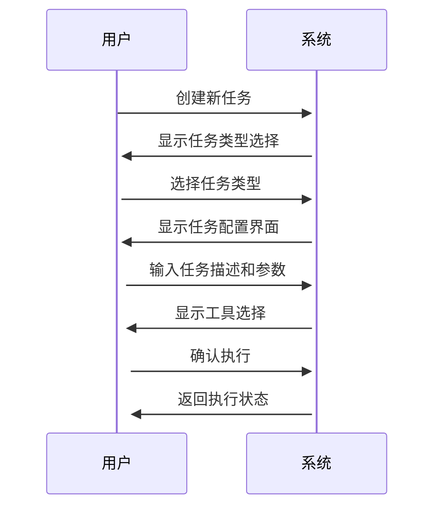

# LocalAgent 交互设计文档

## 用户界面设计

### 1. Web界面布局

#### 1.1 主界面结构
```
+------------------------+
|        顶部导航栏       |
+------------------------+
|      |                |
| 侧边栏|    主内容区     |
|      |                |
+------------------------+
|        状态栏          |
+------------------------+
```

#### 1.2 组件详情

##### 顶部导航栏
- 系统Logo
- 主要功能导航
- 用户信息
- 通知中心
- 设置菜单

##### 侧边栏
- 任务列表
- 工具箱
- 历史记录
- 收藏夹

##### 主内容区
- 任务编辑器
- 执行状态展示
- 结果显示
- 工具操作区

##### 状态栏
- 系统状态
- 资源使用情况
- 网络状态
- 模型连接状态

### 2. 交互流程

#### 2.1 任务创建流程
1. 选择任务类型
2. 输入任务描述
3. 配置任务参数
4. 选择执行工具
5. 确认并执行



#### 2.2 任务监控流程
1. 实时状态更新
2. 进度展示
3. 资源使用监控
4. 错误提示
5. 结果预览

#### 2.3 结果展示流程
1. 结果摘要
2. 详细信息展开
3. 可视化展示
4. 导出选项
5. 分享功能

### 3. 响应式设计

#### 3.1 桌面端布局
- 最小分辨率：1280 x 720
- 推荐分辨率：1920 x 1080
- 支持宽屏显示

#### 3.2 移动端适配
- 响应式菜单
- 简化操作流程
- 触摸优化
- 垂直布局

### 4. 视觉设计

#### 4.1 配色方案
```css
:root {
    /* 主题色 */
    --primary-color: #2196F3;
    --secondary-color: #FFC107;
    --success-color: #4CAF50;
    --warning-color: #FF9800;
    --error-color: #F44336;
    
    /* 中性色 */
    --text-primary: #333333;
    --text-secondary: #666666;
    --background: #FFFFFF;
    --border: #E0E0E0;
}
```

#### 4.2 字体系统
```css
:root {
    /* 字体家族 */
    --font-family: -apple-system, BlinkMacSystemFont, 'Segoe UI', Roboto, Oxygen, Ubuntu, Cantarell, 'Open Sans', 'Helvetica Neue', sans-serif;
    
    /* 字体大小 */
    --font-size-xs: 12px;
    --font-size-sm: 14px;
    --font-size-md: 16px;
    --font-size-lg: 18px;
    --font-size-xl: 20px;
}
```

#### 4.3 图标系统
- Material Design Icons
- 自定义SVG图标
- 动态图标
- 状态图标

### 5. 交互反馈

#### 5.1 加载状态
- 全局加载
- 局部加载
- 进度指示
- 骨架屏

#### 5.2 操作反馈
- Toast提示
- 对话框
- 操作确认
- 错误提示

#### 5.3 动画效果
```css
:root {
    /* 动画时长 */
    --animation-duration-fast: 200ms;
    --animation-duration-normal: 300ms;
    --animation-duration-slow: 400ms;
    
    /* 动画曲线 */
    --ease-in-out: cubic-bezier(0.4, 0, 0.2, 1);
    --ease-out: cubic-bezier(0.0, 0, 0.2, 1);
    --ease-in: cubic-bezier(0.4, 0, 1, 1);
}
```

### 6. 辅助功能

#### 6.1 快捷键系统
```javascript
const shortcuts = {
    'Ctrl + N': '新建任务',
    'Ctrl + S': '保存任务',
    'Ctrl + E': '执行任务',
    'Ctrl + P': '暂停任务',
    'Ctrl + Space': '命令面板',
    'Esc': '取消操作'
};
```

#### 6.2 无障碍支持
- ARIA标签
- 键盘导航
- 高对比度模式
- 屏幕阅读器支持

#### 6.3 国际化
- 多语言支持
- 时区适配
- 数字格式化
- 日期本地化

### 7. 错误处理

#### 7.1 用户输入验证
- 实时验证
- 错误提示
- 输入建议
- 自动修正

#### 7.2 异常状态展示
- 网络错误
- 权限不足
- 资源不可用
- 系统维护

### 8. 性能优化

#### 8.1 加载优化
- 懒加载
- 预加载
- 资源压缩
- 缓存策略

#### 8.2 渲染优化
- 虚拟列表
- 防抖节流
- 批量更新
- 组件缓存

### 9. 示例界面

#### 9.1 任务创建界面
```
+------------------------+
|     任务创建向导        |
+------------------------+
| 步骤: 1/4             |
+------------------------+
| 选择任务类型:          |
| ○ 代码分析            |
| ○ 数据处理            |
| ○ 文档生成            |
| ○ 自定义任务          |
+------------------------+
| [上一步]    [下一步]   |
+------------------------+
```

#### 9.2 执行状态界面
```
+------------------------+
|     任务执行状态        |
+------------------------+
| 任务ID: TASK-001      |
| 状态: 执行中          |
| 进度: [=====>   ] 60% |
+------------------------+
| 实时日志:             |
| > 开始执行...         |
| > 加载数据...         |
| > 处理中...           |
+------------------------+
| [暂停] [终止] [日志]   |
+------------------------+
```

#### 9.3 结果展示界面
```
+------------------------+
|     任务执行结果        |
+------------------------+
| 概要信息:             |
| - 执行时间: 2.5s      |
| - 内存使用: 256MB     |
| - 状态: 成功          |
+------------------------+
| 详细结果:             |
| [表格视图] [图表视图]  |
+------------------------+
| [导出] [分享] [重试]   |
+------------------------+
``` 